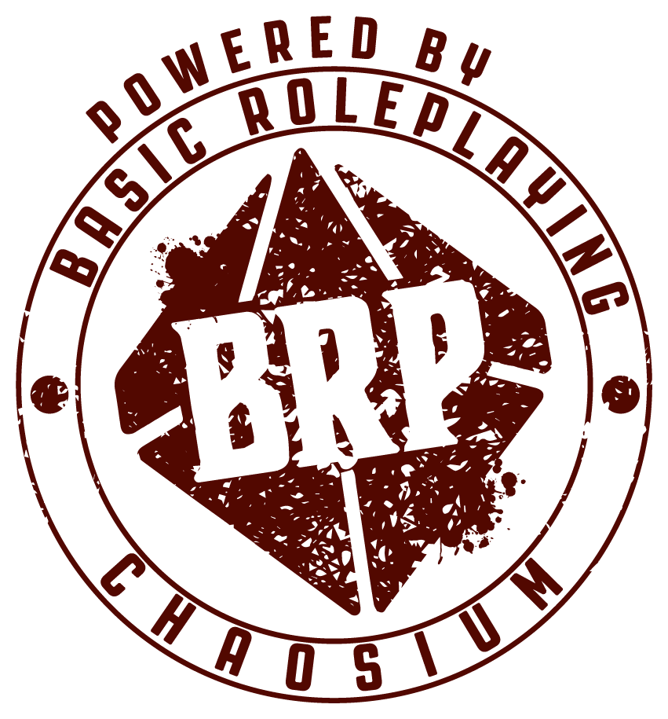

# Basic Roleplaying — Universal Game Engine — Documento de Conteúdo ORC

## Créditos

Baseado no sistema Basic Roleplaying criado por Steve Perrin, Steve Henderson, Warren James, Greg Stafford, Sandy Petersen, Ray Turney e Lynn Willis

**Autores** Jason Durall e Steve Perrin

**Produtor** Neil Robinson

**Créditos adicionais** Daria Pilarczyk, Rick Meints, Michael O’Brien e Jeff Richard

**Agradecimentos especiais** Ken St. Andre, Ken Austin, William Barton, Bill Dunn, Ken Finlayson, Mark L. Gambler, Sam Johnson, William Jones, Rodney Leary, Ben Monroe, Gordon Monson, Sarah Newton, Sam Shirley, Mark Morrison e Richard Watts

## Dados de publicação

Publicado nos Estados Unidos da América pela Chaosium Inc.

3450 Wooddale Court, Ann Arbor, MI 48104

chaosium.com

BASIC ROLEPLAYING: UNIVERSAL GAME ENGINE

Copyright © 2023 pela Chaosium Inc. Todos os direitos reservados.

Basic Roleplaying é copyright © 1981, 1983, 1992, 1993, 1995, 1998, 1999, 2001, 2004, 2008, 2010, 2023 pela Chaosium Inc.; todos os direitos reservados.

Basic Roleplaying é marca registrada da Chaosium Inc.

Chaosium Inc. e o logotipo da Chaosium são marcas registradas da Chaosium Inc.

## Aviso ORC

Este produto está licenciado sob a Licença ORC registrada na Biblioteca do Congresso sob o número TX 9-307-067 e disponível online em vários locais, incluindo [www.chaosium.com/orclicense](https://www.chaosium.com/orclicense), [www.azoralaw.com/orclicense](https://www.azoralaw.com/orclicense), [www.paizo.com/orclicense](https://paizo.com/orclicense) e outros. Todas as garantias são excluídas conforme estabelecido no documento. Este produto é uma obra original da Chaosium.

Se você usar nosso Conteúdo ORC, por favor, também nos dê crédito da seguinte forma:

<figure style="margin-left:0;">
    <!-- A imagem original foi redimensionada para ficar do tamanho aproximado que ela aparece nos documentos PDF/RTF -->
    
    <figcaption>Logotipo "Powered by BRP"</figcaption>
</figure>

Com pouquíssimas exceções (termos registrados), o texto de BASIC ROLEPLAYING: UNIVERSAL GAME ENGINE está disponível para uso pessoal e comercial sob a licença ORC.
